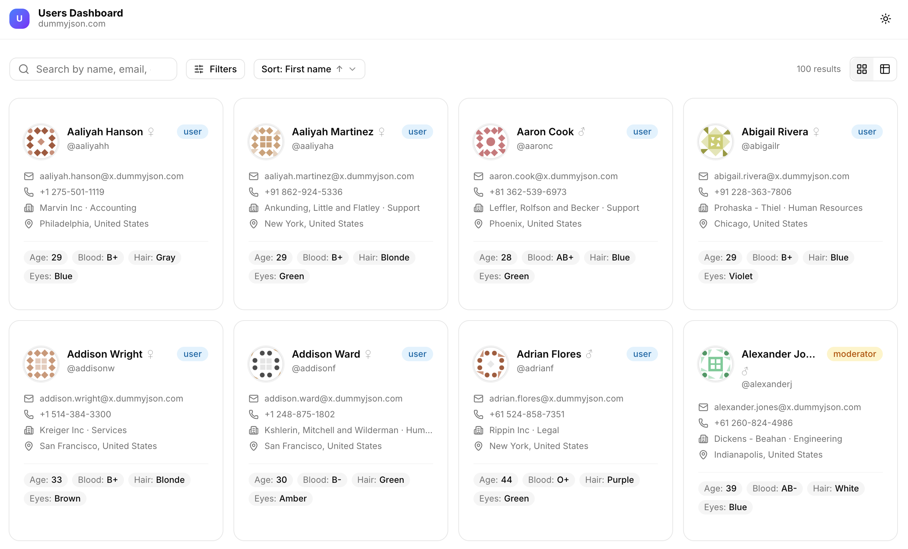
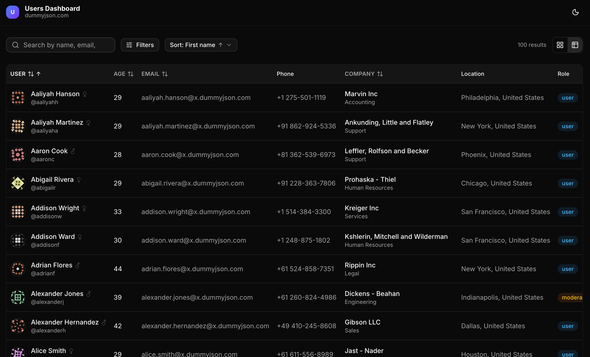
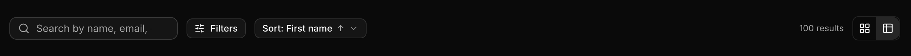
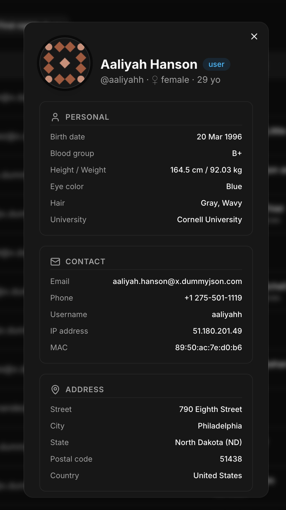

# Users Dashboard

> Полнофункциональный дашборд для просмотра и управления пользователями,
> построенный на Next.js, TypeScript и shadcn/ui.

---

## Скриншоты

<table>
  <tr>
    <td align="center">
      
      <br/>
      <em>Grid view — светлая тема</em>
    </td>
    <td align="center">
      
      <br/>
      <em>Table view — тёмная тема</em>
    </td>
  </tr>
  <tr>
    <td align="center">
      
      <br/>
      <em>Фильтры и поиск</em>
    </td>
    <td align="center">
      
      <br/>
      <em>Детальный профиль пользователя</em>
    </td>
  </tr>
</table>

---

## Возможности

### Просмотр пользователей

- **Grid / Table** — два режима отображения с переключением в один клик
- Сохранение выбранного режима между сессиями (localStorage)
- Адаптивная сетка: 1 → 2 → 3 → 4 колонки в зависимости от ширины экрана

### Поиск и фильтрация

- **Поиск** по имени, email, компании — с debounce 400 мс
- **Фильтр по полу** — все / мужской / женский
- **Фильтр по роли** — admin / moderator / user
- **Фильтр по возрасту** — диапазон от / до
- Счётчик активных фильтров на кнопке
- Сброс всех фильтров одной кнопкой

### Сортировка

- По имени, фамилии, возрасту, email, компании
- Переключение направления: по возрастанию ↑ / по убыванию ↓
- Активное поле сортировки подсвечено в выпадающем меню

### Пагинация

- Навигация: первая / предыдущая / страницы / следующая / последняя
- Умное отображение номеров с ellipsis при большом количестве страниц

### Детальный профиль

Модальное окно по клику на пользователя с разделами:

- Личная информация (дата рождения, физ. параметры, цвет глаз, волосы)
- Контакты (email, телефон, IP, MAC)
- Адрес (улица, город, штат, страна)
- Компания (название, отдел, должность, адрес офиса)
- Банковские данные (тип карты, маскированный номер, IBAN)
- Крипто (монета, сеть, кошелёк)

### UX

- **Dark / Light mode** — переключатель в хедере, следует системной теме
- **Skeleton loaders** — во время загрузки вместо спиннера
- **Error state** — сообщение об ошибке с кнопкой Retry
- **Empty state** — иллюстрированная заглушка при отсутствии результатов
- **Плавная пагинация** — старые данные остаются пока грузятся новые
- **Доступность** — навигация с клавиатуры, ARIA-атрибуты, focus-visible

---

## Стек

| Инструмент                                                | Назначение                         |
| --------------------------------------------------------- | ---------------------------------- |
| [Next.js](https://nextjs.org/)                            | Фреймворк, App Router, SSR         |
| [TypeScript](https://www.typescriptlang.org/)             | Типизация                          |
| [Tailwind CSS](https://tailwindcss.com/)                  | Утилитарные стили                  |
| [shadcn/ui](https://ui.shadcn.com/)                       | UI компоненты на Radix UI          |
| [TanStack Query](https://tanstack.com/query/v5)           | Server state, кеш, фоновый refetch |
| [TanStack Table](https://tanstack.com/table/v8)           | Headless логика таблицы            |
| [Zustand](https://zustand-demo.pmnd.rs/)                  | UI state (фильтры, пагинация, вид) |
| [next-themes](https://github.com/pacocoursey/next-themes) | Dark/light mode                    |

---

## 📁 Структура проекта

```
users-dashboard/
├── docs/
│   ├── screenshots/          # Скриншоты для README
│
├── src/
│   ├── api/
│   │   └──api.ts             # Функции для работы с dummyjson API
│   │
│   ├── app/
│   │   ├── globals.css       # CSS переменные, Tailwind directives
│   │   ├── layout.tsx        # Root layout + метаданные
│   │   ├── page.tsx          # Главная страница (точка входа)
│   │   └── providers.tsx     # QueryClient + ThemeProvider
│   │
│   ├── components/
│   │   ├── dashboard/
│   │   │   ├── dashboard-header.tsx    # Хедер + переключатель темы
│   │   │   ├── dashboard-pagination.tsx # Пагинация
│   │   │   ├── user-card.tsx           # Карточка пользователя
│   │   │   ├── user-detail-modal.tsx   # Модальное окно профиля
│   │   │   ├── user-filters.tsx        # Поиск + фильтры + сортировка
│   │   │   ├── user-grid.tsx           # Сетка карточек
│   │   │   ├── user-table.tsx          # Таблица пользователей
│   │   │   └── view-toggle.tsx         # Grid / Table переключатель
│   │   │
│   │   └── ui/                        # shadcn/ui компоненты (auto-generated)
│   │
│   ├── hooks/
│   │   ├── useUsers.ts        # Главный хук: запрос + фильтрация + пагинация
│   │   └── useDebounce.ts     # Дебаунс для поля поиска
│   │
│   ├── lib/
│   │   └── utils.ts           # cn(), форматирование, вычисление статистики
│   │
│   ├── store/
│   │   └── dashboardStore.ts  # Zustand store: фильтры, пагинация, вид
│   │
│   └── types/
│       └── user.ts            # TypeScript типы (User, filters)
│
├── components.json            # shadcn/ui конфигурация
├── next.config.ts
├── tsconfig.json
└── package.json
```

---

## Быстрый старт

### Установка

**1. Клонировать репозиторий**

```bash
git clone https://github.com/Pepe-f/users-dashboard.git
cd users-dashboard
```

**2. Установить зависимости**

```bash
npm install
```

**3. Запустить в режиме разработки**

```bash
npm run dev
```

Открыть в браузере: [http://localhost:3000](http://localhost:3000)

---

## Архитектурные решения

### Почему TanStack Query + Zustand, а не Redux Toolkit?

**TanStack Query** берёт на себя всё, что связано с сервером:
кеширование, дедупликацию запросов, фоновый refetch, `placeholderData`
для плавной пагинации без мигания, автоматический retry при ошибке.
Redux для этого избыточен.

**Zustand** хранит только UI-состояние: фильтры, номер страницы,
выбранный вид, id открытого пользователя. Минимум бойлерплейта,
встроенный `persist` middleware для сохранения в localStorage.

### Смешанная фильтрация: server-side + client-side

```
Поиск, сортировка  →  server-side (dummyjson API параметры)
Пол, роль, возраст →  client-side (JS .filter() после получения)
```

dummyjson не поддерживает комбинацию всех фильтров одновременно —
нельзя одним запросом получить `search=john&gender=male&role=admin`.
Поэтому загружаем 100 записей одним запросом, остальное фильтруем
и нарезаем на страницы на клиенте. Для реального API с поддержкой
всех параметров это тривиально переносится на сервер.

### Почему TanStack Table для таблицы?

Headless подход — вся логика (сортировка колонок, доступность)
отделена от вёрстки. Стили полностью под нашим контролем через
shadcn/ui `<Table>` компоненты. Легко расширить: добавить
выбор строк, resize колонок, виртуализацию.
